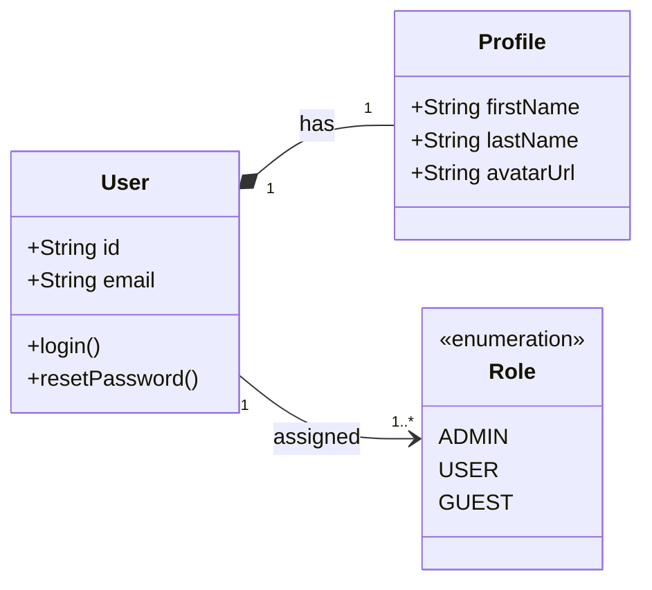
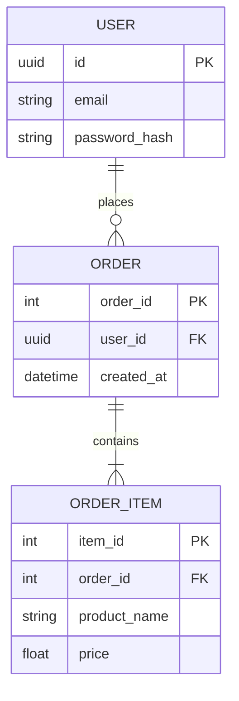

# UML Standards & Data Modeling

While general flowcharts and sequence diagrams show behavior, **UML diagrams** are required to model the static structure of the system, data entities, and their relationships. All agents (especially Architect and Analyst) must use these standards when describing data models or class structures.

## 1. Class Diagrams (Domain Modeling)
Use `classDiagram` to define the core Domain entities, their properties, methods, and relationships (Inheritance, Composition, Aggregation). This is crucial for the Architect when designing the Domain layer.

*Example - Domain Model:*

## 2. Entity-Relationship Diagrams (Database Schema)
When the Architect or Developer is designing the local database (e.g., Room, SQLite) or backend database schema, use `erDiagram` to show tables, columns, primary/foreign keys, and cardinalities.

*Example - DB Schema:*

## 3. When to use which?
- **State/Flowchart (`stateDiagram-v2`, `graph`):** Use for UI navigation, user journeys, and high-level system component interactions.
- **Sequence Diagram (`sequenceDiagram`):** Use for API calls, authentication flows, and time-based communication between distinct systems.
- **Class Diagram (`classDiagram`):** Use for internal business logic, OOP interfaces, and domain models.
- **ER Diagram (`erDiagram`):** Use STRICTLY for relational database design.