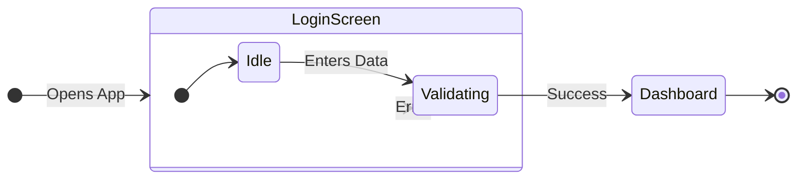
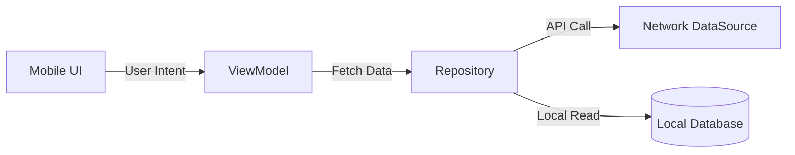

# Visual Documentation Standards

Documentation in this framework is intended to be both developer-friendly and client-ready. To achieve this, ALL agents (especially Analyst and Architect) MUST heavily utilize visual representations rather than relying solely on walls of text.

## 1. Mandatory Mermaid.js Diagrams
Use `mermaid` code blocks to generate diagrams that can be easily rendered by GitHub, GitLab, and modern Markdown viewers.

**CRITICAL LAYOUT RULE:** Always configure Flowcharts and State Diagrams to render Left-to-Right (horizontal) instead of Top-to-Bottom (vertical). This makes them significantly easier to read on standard screens. Use `graph LR` or `direction LR`. *(Note: Sequence Diagrams `sequenceDiagram` inherently flow top-to-bottom to represent time and do not require this).*

### For the Analyst (`spec.md` & User Flows):
Instead of just listing steps, visualize the "User Journey" and "Edge Cases" using horizontal State Diagrams or Flowcharts.
*Example - User Journey (Horizontal):*

### For the Architect (`design.md` & Architecture):
You MUST include a component or system architecture diagram, rendering Left-to-Right.
*Example - System Architecture (Horizontal):*

## 2. ASCII Tables for Data & APIs
When describing data models, API endpoints, or comparing options, ALWAYS use Markdown tables instead of bulleted lists. Tables are easier for clients to scan.

*Example - API Contract:*
| Endpoint | Method | Purpose | Required Auth |
| :--- | :--- | :--- | :---: |
| `/api/v1/users` | `GET` | Fetches user profile | Yes (JWT) |
| `/api/v1/login` | `POST` | Authenticates user | No |

## 3. The "Client-Ready" Rule
Before finalizing any documentation, ask yourself: *"If the client (who may not be a deep technical expert) looks at this, will they understand the core concept in 30 seconds?"*
- Use bolding for emphasis.
- Use emojis (e.g., 🟢, 🔴, ⚠️) sparingly but effectively to denote status or warnings.
- Lead with the diagram, follow with the text explanation.