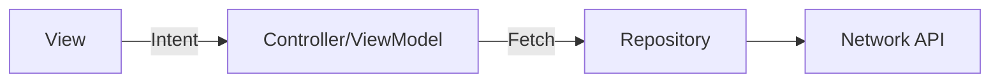
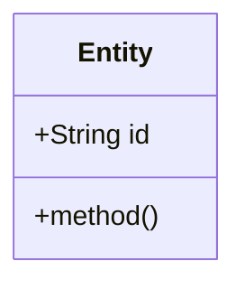
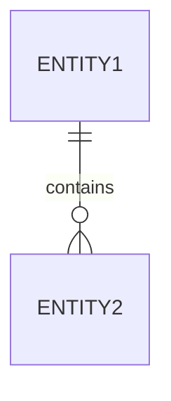

# Architectural Design: {Feature Name}

## 1. Overview
{Technical overview of the implementation approach, highlighting how it meets the requirements in spec.md.}

## 2. Architecture & Components
> **Agent Note:** MUST use Mermaid.js `graph LR` to visualize component architecture and data flow.

## 3. Domain Model (UML)
> **Agent Note:** MUST use Mermaid.js `classDiagram` to represent the core business logic, entities, and their relationships.

## 4. Data Schema (ER Diagram)
> **Agent Note:** If this feature requires local or remote database changes, MUST use Mermaid.js `erDiagram`.

## 5. Security & Performance Considerations
* **Scalability:** {How does this handle 10x growth?}
* **Security:** {Data validation, secrets management.}
* **Performance:** {Caching strategies, rendering optimizations.}

## 6. Architectural Decisions (ADR)
* **Decision 1:** {Why did we choose X over Y?}