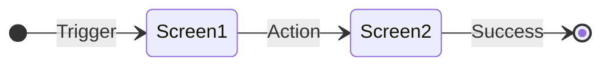

# Feature Specification: {Feature Name}

## 1. Overview
{Brief description of the feature, its goal, and the problem it solves.}

## 2. User Flows (Visualized)
> **Agent Note:** MUST use Mermaid.js `stateDiagram-v2` with `direction LR` to visualize the user's journey between screens and states.

## 3. Data & Security Rules
> **Agent Note:** Use an ASCII table to represent key data requirements, validation rules, or permissions.

| Rule | Parameter | Description |
| :--- | :--- | :--- |
| Example Rule | Value | Description of the rule |

## 4. User Stories & Acceptance Criteria

### {Epic Name}
* **Story:** As a {user type}, I want to {action} so that {benefit}.
  * [ ] {Testable acceptance criterion 1}
  * [ ] {Testable acceptance criterion 2}

## 5. Edge Cases & Constraints
* **Offline behavior:** {What happens without internet?}
* **Error handling:** {What happens on API failure?}
* **Out of Scope:** {Clearly define what is NOT being built.}